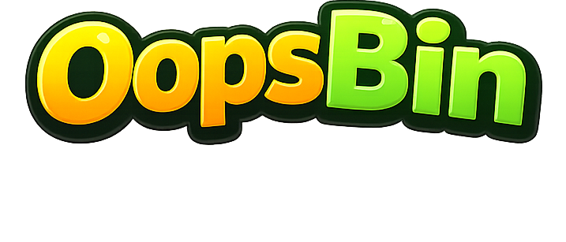
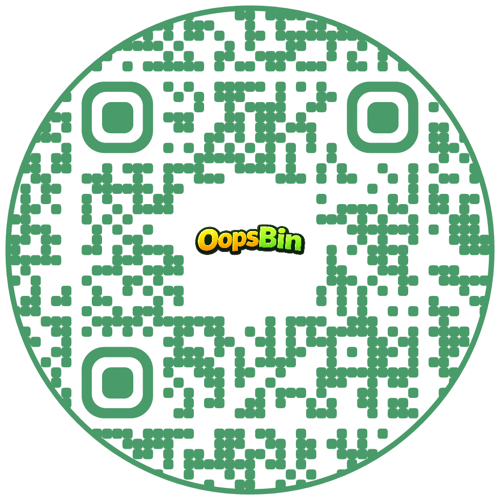
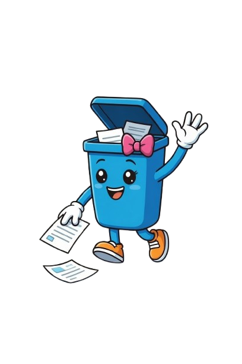
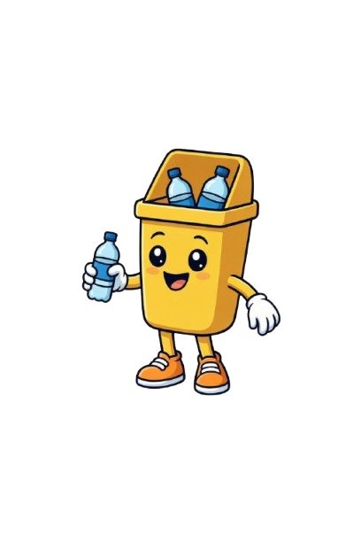
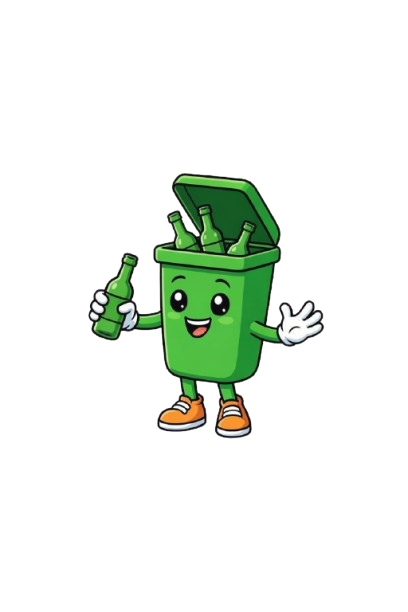
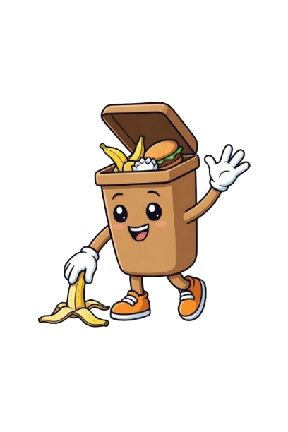
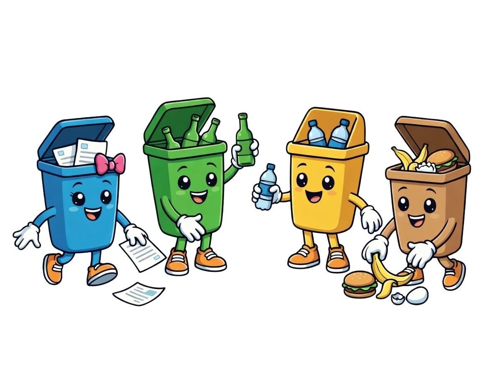

<p align="center">
  
</p>

<p align="center">
  
  <br>
  <em>Escanea para abrir OopsBin</em>
</p>

<p align="center">
  <a href="README.md"></a>
  ·
  
</p>

<p align="center">
  
  
  
  
  
  
  
  
  
  
  
  
</p>

# OopsBin

Sistema de clasificación de residuos multiclase basado en deep learning. Sube una imagen o usa tu cámara y OopsBin te dice en qué contenedor va.

7 categorías | 93.3% de precisión | 4 modelos | 3 idiomas (EN / ES / KO)

---

## Modelos

Se entrenaron y compararon cuatro modelos. **ResNet50** fue elegido como el modelo por defecto en producción por su mejor precisión global.

| Modelo | Arquitectura | Clases | Precisión (test) | Estado |
|--------|--------------|--------|------------------|--------|
| ResNet50 (R) | ResNet50 | 7 | 93.3% | Por defecto |
| EfficientNetB0 Modelo 1 (J) | EfficientNetB0 | 7 | Disponible | Activo |
| EfficientNetB0 Modelo 2 (R) | EfficientNetB0 | 7 | Disponible | Activo |
| MobileNetV2 (N) | MobileNetV2 | 10 | Disponible | Desactivado (clases distintas) |

Todos los modelos se pueden seleccionar desde la pestaña Clasificar de la interfaz web.

---

## Inicio rápido

### Requisitos

- Python 3.10+
- [uv](https://docs.astral.sh/uv/) (recomendado) o pip
- Docker (opcional)

### 1. Clonar el repositorio

```bash
git clone https://github.com/Bootcamp-IA-P6/project4_Team_5.git
cd project4_Team_5
```

### 2. Configurar las variables de entorno

Crea un archivo `.env` en la raíz del proyecto:

```
SUPABASE_URL=supabase_url
SUPABASE_KEY=supabase_anon_key
```

### 3. Ejecutar la aplicación

#### Opción A: uv (recomendado)

```bash
# Instalar uv (si no lo tienes)
# macOS / Linux
curl -LsSf https://astral.sh/uv/install.sh | sh

# Windows
powershell -ExecutionPolicy ByPass -c "irm https://astral.sh/uv/install.ps1 | iex"
```

```bash
uv sync
```

```bash
# macOS / Linux
make dev

# Windows (make no disponible)
uv run python app/main.py
```

Abre http://localhost:8080

#### Opción B: pip

```bash
python -m venv venv
```

```bash
# macOS / Linux
source venv/bin/activate

# Windows CMD
venv\Scripts\activate

# Windows PowerShell
venv\Scripts\Activate.ps1
```

```bash
pip install -r requirements.txt
python app/main.py
```

Abre http://localhost:8080

#### Opción C: Docker

```bash
# macOS / Linux
make docker

# Windows / cualquier SO
docker compose up --build
```

Abre http://localhost:8080

### Comandos de Make (macOS / Linux)

| Comando | Descripción |
|---------|-------------|
| `make dev` | Ejecutar localmente con uv |
| `make docker` | Construir y ejecutar con Docker |
| `make docker-down` | Detener los contenedores de Docker |
| `make docker-rebuild` | Reconstruir Docker desde cero |
| `make clean` | Eliminar todas las imágenes, volúmenes y caché de Docker |

---

## Estructura del proyecto

```
project4_Team_5/
├── app/                          # Aplicación web
│   ├── main.py                   # Backend Flask + API de predicción
│   ├── templates/                # Páginas HTML
│   │   ├── base.html             # Layout base, tema, i18n
│   │   ├── index.html            # App principal (Inicio, Clasificar, Métricas, Acerca de, Contacto)
│   │   └── 404.html              # Página de error
│   └── static/
│       ├── css/style.css         # Estilos (claro/oscuro, accesibilidad)
│       ├── js/main.js            # Lógica del frontend, cámara, feedback
│       ├── img/                  # Logo, mascota, personajes
│       └── music/                # Audio de fondo
│
├── models/                       # Modelos entrenados
│   └── versions/                 # ResNet50, EfficientNetB0 x2, MobileNetV2
│
├── notebooks/                    # Notebooks de entrenamiento y preparación de datos
│
├── config/                       # Archivos de configuración
│
├── data/                         # Gestión de datos
│
├── tests/                        # Tests unitarios
│
├── Dockerfile                    # Imagen del contenedor
├── docker-compose.yml            # Orquestación de contenedores
├── Makefile                      # Atajos de desarrollo
├── requirements.txt              # Dependencias de Python (pip)
├── pyproject.toml                # Dependencias de Python (uv)
└── .env                          # Variables de entorno (no en git)
```

---

## Características

- **Clasificación de imágenes** por subida o arrastrar y soltar
- **Clasificación con cámara** y captura en tiempo real
- **Selección de varios modelos** — elige entre ResNet50, EfficientNetB0 (x2) o MobileNetV2
- **Sistema de feedback** de usuario conectado a Supabase (PostgreSQL)
- **Panel de métricas** con matriz de confusión, F1, curvas de aprendizaje y análisis de errores
- **Multilingüe** (inglés, español, coreano)
- **Accesibilidad** — modo claro/oscuro, modos para daltonismo, control del tamaño de fuente, alto contraste
- **Dockerizado** para un despliegue sencillo
- **Página 404** personalizada

---

## Stack tecnológico

| Capa | Tecnología |
|------|-----------|
| Backend | Flask, Python |
| ML | TensorFlow / Keras (ResNet50, EfficientNetB0, MobileNetV2) |
| Datos | NumPy, Pandas, Pillow, Matplotlib |
| Frontend | HTML, CSS, JavaScript |
| Base de datos | Supabase (PostgreSQL) |
| Herramientas | uv, Make, Jupyter, Git LFS |
| Contenedor | Docker, Docker Compose |
| Entrenamiento | Google Colab / Kaggle (GPU T4) |

---

## Datasets

Se combinaron y unificaron tres datasets públicos de Kaggle:

| Dataset | Clases originales | Imágenes |
|---------|-------------------|----------|
| Garbage Classification | 6 | 2.527 |
| Garbage Classification (12 clases) | 12 | 15.515 |
| RealWaste | 9 | 4.752 |
| **Total tras la unificación** | **7** | **16.756** |

Clases finales: **cartón** | **vidrio** | **metal** | **orgánico** | **papel** | **plástico** | **basura**

División: Entrenamiento 11.036 (80%) | Validación 1.376 (10%) | Test 1.385 (10%)

---

## Endpoints de la API

| Método | Endpoint | Descripción |
|--------|----------|-------------|
| GET | `/` | Aplicación principal |
| GET | `/models` | Listar los modelos disponibles |
| POST | `/predict` | Clasificar una imagen (admite selección de modelo) |
| POST | `/feedback` | Enviar feedback de una predicción |
| GET | `/feedback/stats` | Obtener estadísticas de feedback |

---

## Resumen del entrenamiento

El modelo por defecto (ResNet50) se entrenó en 3 fases usando transfer learning:

| Fase | Épocas | Learning rate | Qué se entrena | Precisión (val) |
|------|--------|---------------|----------------|-----------------|
| Fase 1 — Solo cabeza | 20 | 1e-3 | Cabeza de clasificación (526K params) | 91.5% |
| Fase 2 — Fine-tuning | 15 | 1e-5 | Últimas 30 capas + cabeza | 94.2% |
| Fase 3 — Extendida | 4 (early stop) | 5e-6 | Últimas 30 capas + cabeza | 94.3% |

Resultados finales: **93.3% de precisión en test** | **2.6% de overfitting** (por debajo del umbral del 5%)

---

## Equipo

<table align="center">
  <tr>
    <td align="center">
      <a href="https://www.linkedin.com/in/naizabethbermudez/">
        <br>
        <b>Naizabeth Bermudez</b>
      </a>
    </td>
    <td align="center">
      <a href="https://www.linkedin.com/in/jbrasales/">
        <br>
        <b>Jonathan Brasales</b>
      </a>
    </td>
    <td align="center">
      <a href="https://www.linkedin.com/in/raulmachaca/">
        <br>
        <b>Raul Machaca Luna</b>
      </a>
    </td>
    <td align="center">
      <a href="https://www.linkedin.com/in/ruperthlosada/">
        <br>
        <b>Roberto Molero</b>
      </a>
    </td>
  </tr>
</table>

<p align="center">
  
  <br><br>
  <em>Recicla bien. El planeta te lo agradece.</em>
</p>
